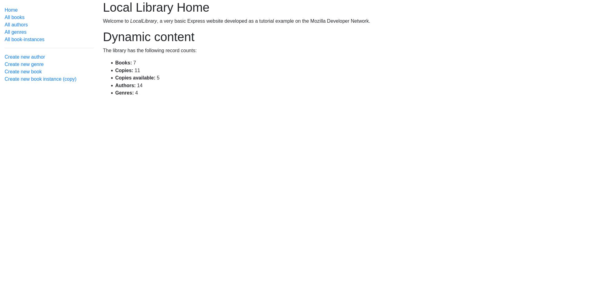

## Local Library Project

Local library project made with Express(Node), following the <a href='https://developer.mozilla.org/en-US/docs/Learn/Server-side/Express_Nodejs/deployment#in_this_module'>MDN tutorial for Express</a>

You can have a look <a href='https://polished-bush-2851.fly.dev/catalog'>here</a> , deployed with Fly.

The templating language used is PUG, throughout layout extensions and blocks.

In the site, there is a sidenav that is always accessible for the user, as well as the content of the main page, which will display the information of every part.

In there the user will be able to perform CRUD operations, to manipulate all kind of data such as books, authors, dates, names, book instances, etc.

**Tools used:**

- NodeJs
- Mongo DB
- Mongoose
- Date FNS
- Dotenv
- MVC
- Helmet
- Compression
- Luxon
- Pug
